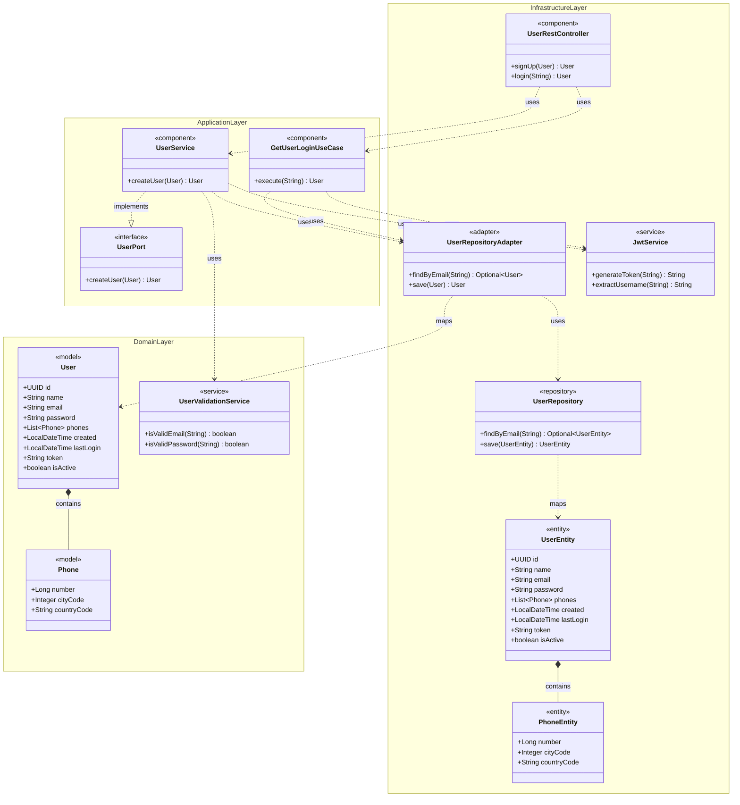
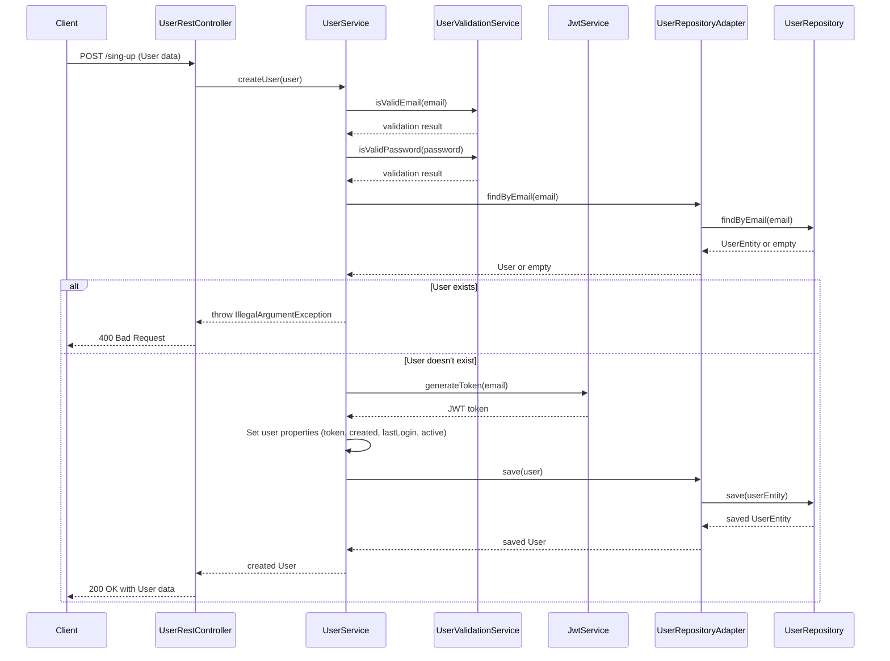
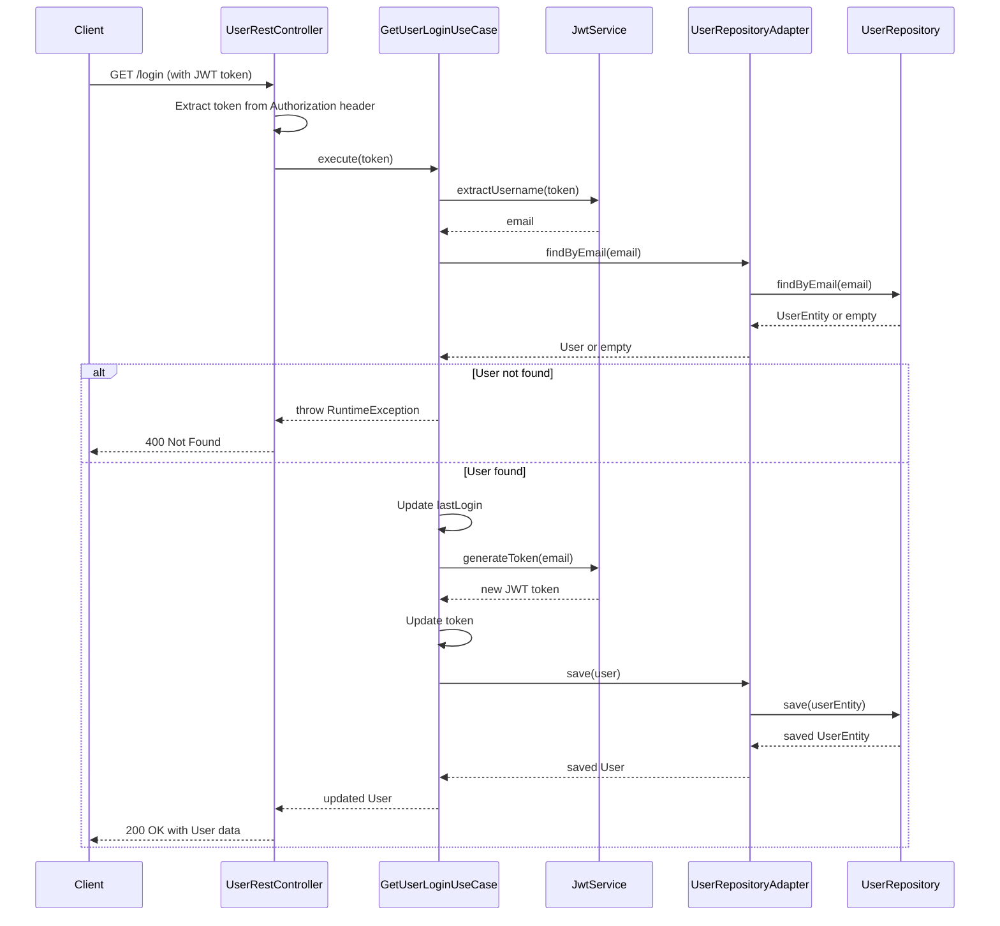

# BCI Test - User Authentication API

## Overview
This project is a RESTful API for user management and authentication built with Spring Boot. It provides endpoints for user registration and authentication using JWT tokens.

## Prerequisites
- Java 11
- Gradle 7.4
- Git

## Project Setup

### Clone the Repository
```bash
git clone https://github.com/yourusername/bci-test.git
cd bci-test
```

### Build the Project
```bash
./gradlew clean build
```

## Configuration
The application uses an H2 in-memory database by default, which means no additional database setup is required for development purposes.

### Application Properties
The main configuration is in `src/main/resources/application.yml`:

```yaml
spring:
  application:
    name: bci-test
  datasource:
    url: jdbc:h2:mem:testdb
    driver-class-name: org.h2.Driver
    username: sa
    password:
  jpa:
    hibernate:
      ddl-auto: update
  h2:
    console:
      enabled: true
```

## Running the Application

### Using Gradle
```bash
./gradlew bootRun
```

### Using Java
```bash
java -jar build/libs/bci-test-0.0.1-SNAPSHOT.jar
```

The application will start on port 8080 by default.

## Accessing the H2 Console
The H2 database console is enabled and can be accessed at:
```
http://localhost:8080/h2-console
```

Use the following connection details:
- JDBC URL: `jdbc:h2:mem:testdb`
- Username: `sa`
- Password: (leave empty)

## API Documentation

### Endpoints

#### User Registration
```
POST /sing-up
```
Request body:
```json
{
  "name": "User Name",
  "email": "user@example.com",
  "password": "password",
  "phones": [
    {
      "number": 123456,
      "cityCode": 1,
      "countryCode": "+1"
    }
  ]
}
```

Request response:
```json
{
  "id": "UUID",
  "name": "User Name",
  "email": "user@example.com",
  "password": "password",
  "phones": [
    {
      "number": 12345,
      "cityCode": 9,
      "countryCode": "+1"
    }
  ],
  "created": "Sep 13, 2025 02:17:13 PM",
  "lastLogin": "Sep 13, 2025 02:17:13 PM",
  "token": "jwt_token",
  "active": true
}
```

#### User Login
```
GET /login
```
Header:
```
Authorization: Bearer {jwt_token}
```

Request response:
```json
{
  "id": "UUID",
  "name": "User Name",
  "email": "user@example.com",
  "password": "password",
  "phones": [
    {
      "number": 12345,
      "cityCode": 9,
      "countryCode": "+1"
    }
  ],
  "created": "Sep 13, 2025 02:17:13 PM",
  "lastLogin": "Sep 13, 2025 03:17:13 PM (updated)",
  "token": "new_jwt_token",
  "active": true
}
```

## Running Tests
```bash
./gradlew test
```

## Technologies Used
- Spring Boot 2.5.14
- Spring Data JPA
- Spring Security
- H2 Database
- JWT for Authentication
- Lombok
- JUnit for Testing

## Architecture Diagrams

### Component Diagram



### Sequence Diagrams

#### Sign-up Endpoint



#### Login Endpoint


